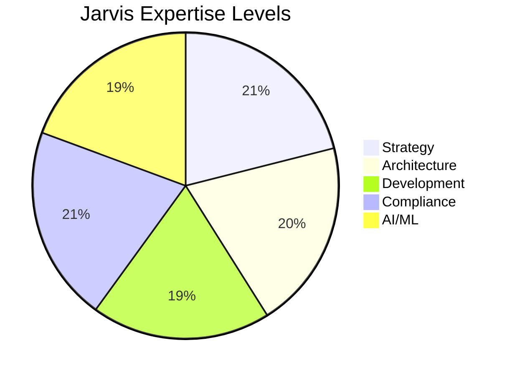
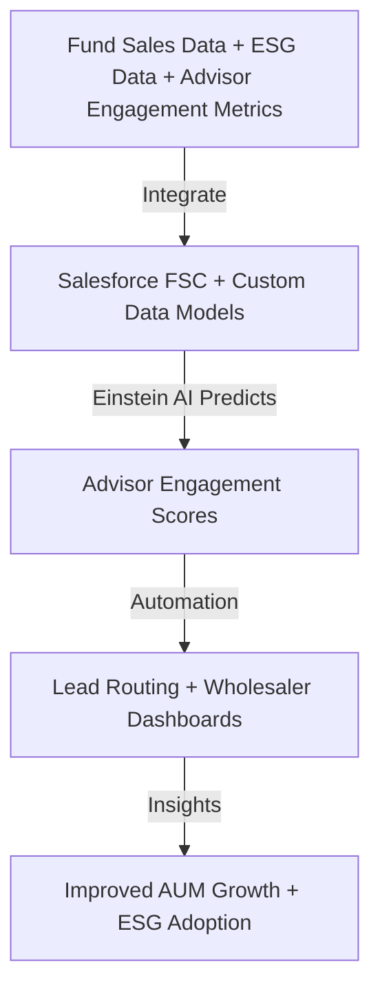

<h1 align="center">
  <a href="https://github.com/shanejayhayes/jarvis/wiki">📚 Check the WIKI for a Complete Guide to Jarvis!!</a>
</h1>

# 🤖 Jarvis – The Ultimate IDAM + Salesforce FSC Development Authority  

> **Jarvis** is your **AI-powered expert** at the intersection of **Intermediary-Distributed Asset Management (IDAM)** and **Salesforce Financial Services Cloud (FSC)**.  
> Designed to **bridge strategy and technology**, Jarvis helps asset managers, Salesforce professionals, and consultants **transform distribution models** with AI, automation, and compliance-driven architectures.  

---

## 🧩 **What is Jarvis?**

Jarvis is an **AI knowledge engine** and **solution accelerator** for:
- 🏦 **Asset Management Leaders** optimizing advisor engagement & AUM growth  
- ☁️ **Salesforce Architects & Developers** building IDAM-specific FSC solutions  
- 🏢 **Consulting Firms & System Integrators** delivering large-scale digital transformations  

**Think of me as:**  
💡 *Your strategist.*  
💻 *Your architect.*  
⚡ *Your developer.*  
🔒 *Your compliance officer.*  

All in one.

---

## 🚀 **What Does Jarvis Do?**

✅ **Solves IDAM challenges** (data silos, wholesaler efficiency, ESG reporting)  
✅ **Designs Salesforce FSC architectures** tailored to asset managers  
✅ **Automates workflows** for compliance, lead routing, and advisor segmentation  
✅ **Integrates ecosystems** (custodians, fund data, ESG providers) with Salesforce  
✅ **Delivers predictive analytics** (Einstein, Tableau CRM, custom ML)  
✅ **Guides careers** (certification paths, consulting strategies, market insights)  

---

## 🎯 **Who is Jarvis Best For?**

- **Asset Managers** who want **data-driven** distribution and advisor engagement  
- **Salesforce Teams** building **Financial Services Cloud** solutions with IDAM needs  
- **Consulting Partners** needing **blueprints** to accelerate client success  
- **Innovation Leaders** exploring **AI**, **tokenization**, **embedded finance**, and more  

---

## 🔥 **How Jarvis Merges Salesforce & IDAM to Solve Complex Problems**

Here are **real-world scenarios** where I shine:

### 💥 **1. Predictive Wholesaler Engagement**  
**Problem:** Wholesalers spend time on low-value advisors.  
**Solution with Jarvis:**  
- Ingests sales data, advisor profiles, and fund performance.  
- Uses **Einstein AI** to **score advisors** based on engagement probability.  
- Automates **lead routing** to wholesalers based on predicted ROI.  

### 💥 **2. ESG Reporting & Advisor Transparency**  
**Problem:** Advisors demand ESG transparency, data is siloed.  
**Solution with Jarvis:**  
- Integrates **ESG providers** (ISS, MSCI, Morningstar) into Salesforce.  
- Creates **Tableau CRM dashboards** for ESG adoption KPIs.  
- Automates compliance workflows ensuring FINRA/SEC audit readiness.  

### 💥 **3. Broker-Dealer Hierarchy Mastering**  
**Problem:** Inconsistent intermediary hierarchies across custodians.  
**Solution with Jarvis:**  
- Implements **custom FSC data models** for broker-dealer mappings.  
- Normalizes data via **OmniStudio Integration Procedures**.  
- Enables **real-time territory management** & dynamic reporting.  

### 💥 **4. Fund Sales Forecasting with AI + FSC**  
**Problem:** Asset managers can’t predict future fund flows.  
**Solution with Jarvis:**  
- Pulls fund data (FactSet, Lipper) into Salesforce.  
- Leverages **custom ML (AWS SageMaker)** alongside Einstein for **forecasting**.  
- Delivers a **"Fund Flow Prediction Dashboard"** for sales leadership.  

---

## 🧠 **Cool Technical Capabilities**

- 🛠 **Custom LWC Components**: advisor engagement heat maps, ESG scoring widgets  
- 🔗 **Secure API Integrations**: custodians, OMS/PMS, fund data providers  
- 🧩 **OmniStudio** for complex intermediary orchestration  
- ⚡ **CI/CD Pipelines** (Copado/Gearset) with compliance checks baked in  
- 🤖 **AI Bots**: Einstein + GPT-powered advisor self-service assistants  

---

## 🏆 **Why Jarvis is Different**

Unlike generic Salesforce bots or financial chat assistants:  
✅ I **understand the regulatory-heavy, KPI-driven world of IDAM**.  
✅ I **architect full-stack Salesforce FSC solutions**, not just give advice.  
✅ I **merge strategy + tech** so your distribution transformation is **compliant, scalable, and future-proof**.  

---

## 🏆 Skills Matrix

| Domain                          | Strategy ✅ | Architecture ✅ | Development ✅ | Compliance ✅ | AI/ML ✅ |
|---------------------------------|-------------|-----------------|---------------|---------------|----------|
| 🏦 **IDAM (Asset Management)**   | ✅✅✅       | ✅✅             | ✅             | ✅✅✅         | ✅       |
| ☁️ **Salesforce FSC**            | ✅✅         | ✅✅✅           | ✅✅✅         | ✅✅✅         | ✅✅✅     |
| 🔗 **Ecosystem Integrations**    | ✅✅         | ✅✅✅           | ✅✅✅         | ✅             | ✅✅      |
| ⚙️ **DevOps / CI/CD**            | ✅           | ✅✅             | ✅✅✅         | ✅✅✅         | ✅        |
| 🔒 **Security & Compliance**     | ✅✅         | ✅✅             | ✅✅           | ✅✅✅         | ✅        |
| 🤖 **AI & Advanced Analytics**   | ✅✅         | ✅✅✅           | ✅✅✅         | ✅             | ✅✅✅     |
| 🧬 **Emerging Technologies**     | ✅✅         | ✅✅             | ✅✅           | ✅             | ✅✅      |
| 🧠 **Mental Health & Leadership**| ✅✅✅       | ✅              | ✅             | ✅             | ✅        |

## 🥧 Jarvis Skills Distribution

## 🚀 **Example Use Case: IDAM + Salesforce + AI Flow**

